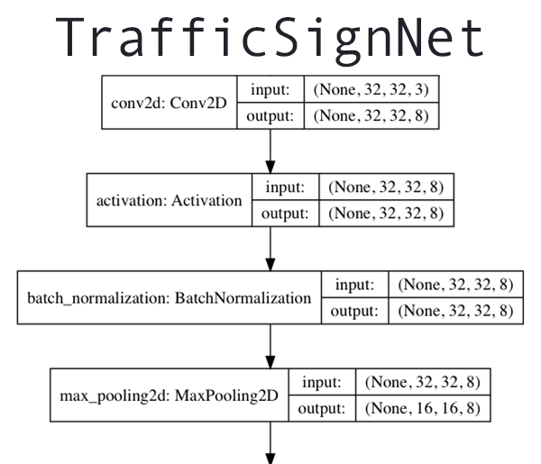

# TrafficSignDetection

This is a program to detect the a traffic sign from an image. The program is using ML model training. The training dataset of images was downloaded from kaggle.com. Kaggle is a website where several such datasets can easily be found for a variety of purposes. The dataset is over 300MB, and has not been downlaoded onto this repository because of its size. It can be easily be donwloaded at this [link](https://www.kaggle.com/meowmeowmeowmeowmeow/gtsrb-german-traffic-sign)

## Prerequisites

_Dataset_

Download the dataset from the kaggle link above. The programs downloaded from this repository and the dataset must lie in the same directory!

_Modules_

Before running the Python code on the repository, it has to be ensured that your computer has Python 3.8 and the other modules, mentioned in the following list pre-installed, as they shall all be imported in the ```predict.py``` and ```train.py```
- keras
- tensorflow
- skimage (also called scikit-image)
- imutils
- random
- OpenCV
- os
- matplotlib
- argparse
- numpy
In case any of these are not installed, runnning the programs will return an error. Detecting from the error, the modules can be installed directly from the **command line** using the command ```pip install <module name>``` (or ```pip3``` if Python3 is not the default).

## Running the program
After downloading the repository and fulfilling the pre-requisites, the programs can be easily run from the command line after navigating into the directory with the programs and the image dataset.

### Train
As with any ML program, first the system is to be trained using the command 
```python train.py```
### Predict
Usage for the predict command:

```python predict.py --model output/trafficsignnet.model --images gtsrb-german-traffic-sign/Test --examples examples```

_Representation of the Neural Network Structure formed_



## Built Using

ML and neural-network libraries like Keras, tensorflow, matplotlib, and image detection libraries like OpenCV and imutils

## Author

Tejas Karnani

Please feel free to contact me in case any issues are faced with the running of this program, mail- tejaskarnani1@gmail.com

Also please check out my other repositories displaying my interesting projects!
